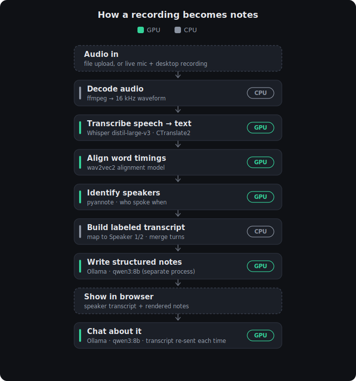

# AI Note-Taker

A fully **local** web app: upload an audio or video recording, and it

1. **Transcribes** it and **identifies speakers** (Speaker 1, Speaker 2, …) with WhisperX.
2. **Generates structured notes** from the speaker-labeled transcript using a local LLM (Ollama / Qwen3).
3. Shows the **transcript** and the **notes** in the browser.
4. Lets you **chat** with the local LLM about the recording.

No external APIs, no API keys, no cloud calls — everything runs on your machine.
Target hardware: a GPU with ~12 GB VRAM.

## Pipeline

Each recording runs through these stages — green runs on the **GPU**, grey on the
**CPU**. Transcription/alignment/diarization can run on either device
(`WHISPER_DEVICE`); the LLM (notes + chat) always runs on the GPU via Ollama.

<p align="center">
  
</p>

---

## Prerequisites

### 1. Ollama (the local LLM)
Install [Ollama](https://ollama.com/), then pull a model:

```bash
ollama pull qwen3:14b      # default (~9 GB VRAM)
# or, for more speed / less VRAM:
ollama pull qwen3:8b
```

Ollama serves at `http://localhost:11434` by default. Leave it running.

### 2. ffmpeg (required by WhisperX)
WhisperX uses ffmpeg to decode audio/video.

- **Windows:** `winget install ffmpeg` (or `choco install ffmpeg`), or download from
  https://ffmpeg.org and add the `bin` folder to your `PATH`.
- **macOS:** `brew install ffmpeg`
- **Linux:** `sudo apt install ffmpeg`

Verify with `ffmpeg -version`.

### 3. Hugging Face token (for speaker diarization)
The pyannote diarization model requires a free Hugging Face account:

1. Create an account at https://huggingface.co.
2. Accept the model terms (visit each model page and click *Agree*). The
   installed WhisperX (3.8.x / pyannote-audio 4.x) defaults to
   **`pyannote/speaker-diarization-community-1`**, so accept that one. Older
   WhisperX used `pyannote/speaker-diarization-3.1` (+ `pyannote/segmentation-3.0`);
   accepting those too does no harm.
3. Create an access token: https://huggingface.co/settings/tokens.
4. Put it in your `.env` as `HF_TOKEN` (see below).

> Without `HF_TOKEN`, transcription still works but everything is labeled
> "Speaker 1" (no diarization).

---

## Install

```bash
python -m venv .venv
# Windows (PowerShell):
.\.venv\Scripts\Activate.ps1
# macOS / Linux:
# source .venv/bin/activate
```

**Install PyTorch first**, matching your setup — WhisperX depends on it and the
right build is not installed automatically. Pick the command from
https://pytorch.org/get-started/locally/. Examples:

```bash
# NVIDIA GPU (CUDA 12.1):
pip install torch torchaudio --index-url https://download.pytorch.org/whl/cu121

# CPU only:
pip install torch torchaudio --index-url https://download.pytorch.org/whl/cpu
```

Then install the rest:

```bash
pip install -r requirements.txt
```

Copy the env template and fill it in:

```bash
cp .env.example .env      # Windows: copy .env.example .env
```

Edit `.env` and set `HF_TOKEN`. Defaults for everything else are fine.

---

## Run

Run uvicorn **from the venv**. Either activate it first:

```powershell
# Windows (PowerShell):
.\.venv\Scripts\Activate.ps1   # prompt should now show (.venv)
python -m uvicorn app:app --reload
```

…or, without activating, call the venv's Python directly (foolproof):

```powershell
.\.venv\Scripts\python.exe -m uvicorn app:app --reload
```

> ⚠️ Don't run bare `uvicorn app:app` unless the venv is activated — a global
> `uvicorn` will use the wrong Python and fail with `ModuleNotFoundError: No
> module named 'dotenv'`.

Open http://localhost:8000, choose a recording (`.mp3 .mp4 .m4a .wav .mov .webm`),
and click **Transcribe**.

> ⏳ **First run is slow:** WhisperX downloads the Whisper + alignment +
> diarization models the first time. They are cached afterwards.

---

## Configuration (`.env`)

| Variable               | Default                  | Notes                                                   |
| ---------------------- | ------------------------ | ------------------------------------------------------- |
| `OLLAMA_MODEL`         | `qwen3:14b`              | Use `qwen3:8b` for more speed.                          |
| `OLLAMA_HOST`          | `http://localhost:11434` | Local Ollama server.                                    |
| `WHISPER_MODEL`        | `base`                   | `tiny` / `base` / `small` / `medium` / `large-v3`.      |
| `WHISPER_DEVICE`       | `cpu`                    | `cuda` to run WhisperX on the GPU (needs spare VRAM).   |
| `WHISPER_COMPUTE_TYPE` | `int8`                   | Use `float16` on GPU.                                   |
| `HF_TOKEN`             | *(empty)*                | Required for speaker diarization.                       |

### VRAM plan (12 GB)
- Run the **LLM on the GPU** (`qwen3:14b` ≈ 9 GB).
- Run **WhisperX on the CPU** (`WHISPER_DEVICE=cpu`, `WHISPER_COMPUTE_TYPE=int8`).
  It's a one-shot batch step, so CPU is fine and the GPU stays free for the model.
- **Alternative (GPU transcription):** use a small Whisper model
  (`WHISPER_MODEL=small`, `WHISPER_DEVICE=cuda`, `WHISPER_COMPUTE_TYPE=float16`)
  together with `qwen3:8b` so both fit in 12 GB.

### GPU transcription (optional)
Running WhisperX on the GPU is much faster than CPU. To enable it:

1. Install the **CUDA build of PyTorch** (matching your CUDA version), e.g.:
   ```bash
   pip install --upgrade "torch==2.8.0" "torchaudio==2.8.0" --index-url https://download.pytorch.org/whl/cu128
   ```
   (The CUDA build also runs CPU mode, so you don't need a separate environment.)
2. Set in `.env`: `WHISPER_DEVICE=cuda` and `WHISPER_COMPUTE_TYPE=float16`.
3. Restart. The app prints the detected GPU at startup, and exposes torch's
   bundled cuDNN/cuBLAS to CTranslate2 automatically (no separate cuDNN install).

If CUDA isn't actually available, the app warns and falls back to CPU. Watch
VRAM: WhisperX on GPU shares the card with Ollama, so a heavy LLM + a game can
exhaust 12 GB.

---

## How it works

- `POST /api/transcribe` — saves the upload to a temp file, runs WhisperX
  (transcribe → align → diarize → assign speakers), builds a speaker-labeled
  `transcript` + `segments`, generates `notes` via Ollama, and returns
  `{ transcript, segments, notes }`.
- `POST /api/chat` — body `{ transcript, messages }`. The transcript is sent in
  the system prompt with each request (the backend is **stateless**); returns
  `{ reply }`.

`SPEAKER_00 / SPEAKER_01 / …` from WhisperX are mapped to `Speaker 1 / Speaker 2`
in order of first appearance.

## Project structure

```
app.py              FastAPI backend (WhisperX + Ollama)
requirements.txt
static/index.html   Single-page frontend
.env.example
README.md
```

## Not included (future polish)
Renaming speakers, setting the expected number of speakers, chunking very long
recordings, and saving past sessions.
